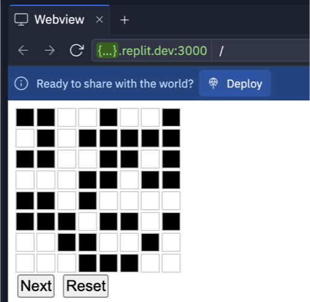
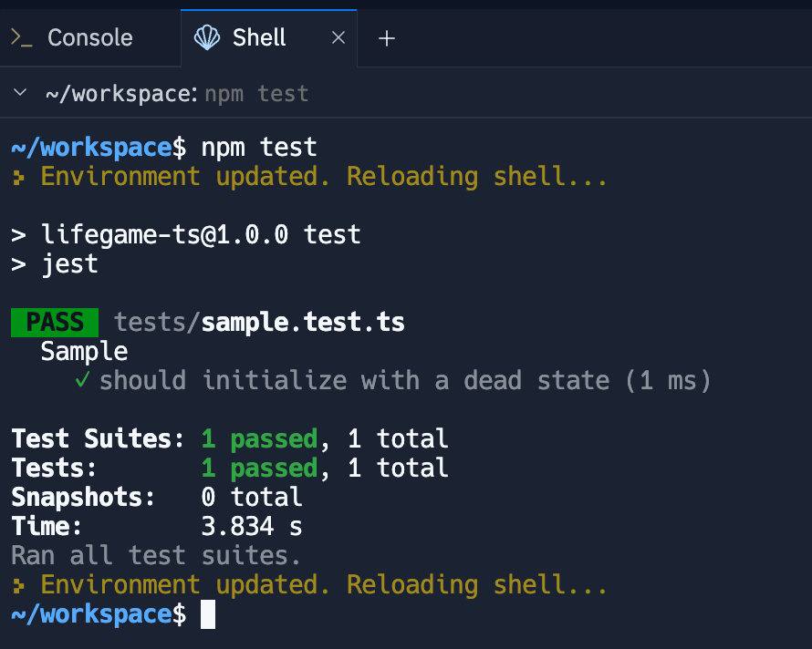

# lifegame-ts-web

## 概要

- TypeScriptによるコンウェイのライフゲームWebアプリケーション

## ルール

- ライフゲームでは初期状態のみでその後の状態が決定される。碁盤のような格子があり、一つの格子はセル（細胞）と呼ばれる。各セルには8つの近傍のセルがある (ムーア近傍) 。各セルには「生」と「死」の2つの状態があり、あるセルの次のステップ（世代）の状態は周囲の8つのセルの今の世代における状態により決定される。
- セルの生死は次のルールに従う。
  - 誕生
    - 死んでいるセルに隣接する生きたセルがちょうど3つあれば、次の世代が誕生する。
  - 生存
    - 生きているセルに隣接する生きたセルが2つか3つならば、次の世代でも生存する。
  - 過疎
    - 生きているセルに隣接する生きたセルが1つ以下ならば、過疎により死滅する。
  - 過密
    - 生きているセルに隣接する生きたセルが4つ以上ならば、過密により死滅する。
  - 下に中央のセルにおける次のステップでの生死の例を示す。生きているセルは■、死んでいるセルは□で表す。
  - 端と角のセルの場合、格子の外のセルは死んだものとして扱う。
- 格子のサイズN x Mは環境変数のパラメータで指定が可能でデフォルトを8 x 8とする。
- 画面に `Next` ボタンを配置し押すたびに次の世代を表示する。
- 画面に `Reset` ボタンを配置し状態をリセットし表示する。
- 初期状態はランダムに決定する。

## 実行手順

1. プロジェクトのディレクトリに移動します。
   ```
   cd lifegame-ts-web
   ```
2. 依存関係をインストールします。
   ```
   npm install
   ```
3. TypeScriptのビルドを行います。
   ```
   npm run dev
   ```
4. ブラウザで以下のURLにアクセスします。
   ```
   http://localhost:5173/
   ```

## デフォルト実装について

1. ランダムの状態で格子を表示するように実装されています。

   1. Runボタンをクリックすると以下のように表示されます。
      
   2. ルールに従った世代ごとの表示を実装してください。

2. Next, Resetボタンは空の実装となってます。
   1. Nextボタンで次の世代に進めて表示を更新する実装をしてください。
   2. Resetボタンで世代と初期状態をリセットしてください。

## テスト手順

1. プロジェクトのディレクトリに移動します。
   ```
   cd lifegame-ts-web
   ```
2. テストを実行します。
   ```
   npm test
   ```
   

## 環境変数設定方法

1. プロジェクトのディレクトリに移動します。
   ```
   cd lifegame-ts-web
   ```
2. `.env.local` ファイルを作成し、以下の内容を記述します。
   ```
   VITE_GRID_ROWS=16
   VITE_GRID_COLUMNS=16
   ```
3. 必要に応じて、`VITE_GRID_ROWS`と`VITE_GRID_COLUMNS`の値を変更します。
